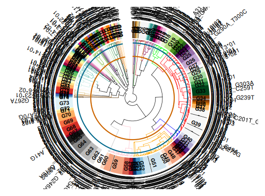

**inferAlleleClusters** - *Allele similarity cluster*

Description
--------------------

A wrapper function to infer the allele clusters. Supports both hierarchical
clustering (default) and Leiden community detection.


Usage
--------------------
```
inferAlleleClusters(
germline_set,
locus = NULL,
clustering_method = c("hierarchical", "leiden"),
distance_method = c("decipher", "hamming", "lv"),
trim_3prime_side = 318,
mask_5prime_side = 0,
family_threshold = 75,
allele_cluster_threshold = 95,
cluster_method = "complete",
resolution = NULL,
target_clusters = NULL,
optimize_silhouette = TRUE,
ncores = 1,
aa_set = FALSE,
quiet = FALSE,
family_prefix = TRUE,
retain_subgroup = FALSE
)
```

Arguments
-------------------

germline_set
:   A character vector of Ig sequence alleles (must be gapped by IMGT scheme for optimal results).

locus
:   The locus type. One of "IGHV", "IGKV", "IGLV", "IGHD", "IGHJ", "IGKJ", "IGLJ".
Default is NULL (auto-detected from sequence names).

clustering_method
:   Clustering method. One of "hierarchical" (default) or "leiden".

distance_method
:   Distance calculation method. One of "decipher" (default), "hamming", or "lv".

trim_3prime_side
:   Position to trim sequences from 3' end. Default is 318; NULL uses full length.

mask_5prime_side
:   Length to mask from 5' side. Default is 0.

family_threshold
:   Similarity threshold for family level. Default is 75.

allele_cluster_threshold
:   Similarity threshold for allele cluster level (hierarchical only). Default is 95.

cluster_method
:   The linkage method for hierarchical clustering (used for family assignment in both methods). Default is "complete".

resolution
:   Resolution parameter for Leiden clustering. Default is NULL (auto-optimized).

target_clusters
:   Target number of clusters for Leiden optimization. Default is NULL.

optimize_silhouette
:   Optimize resolution using silhouette score (Leiden only). Default is TRUE.

ncores
:   Number of cores for parallel processing (Leiden only). Default is 1.

aa_set
:   Logical. Is the sequence set amino acids? Default is FALSE.

quiet
:   Logical. Suppress messages. Default is FALSE.

family_prefix
:   Logical. If TRUE (default), prepend "F" to the family number in ASC names (e.g. IGHVF1-G1*01). If FALSE, omit the "F" (e.g. IGHV1-G1*01).

retain_subgroup
:   Logical. If TRUE, retain the original IMGT subgroup in the ASC name instead of renumbering the family by the clustering (e.g. IGKV1-12*01 stays in subgroup IGKV1-G..). When TRUE, `family_prefix` is ignored. Default FALSE.


Value
-------------------

An object of class [GermlineCluster](GermlineCluster.md) containing:

+  germlineSet: Modified germline set (3' trimming and 5' masking)
+  alleleClusterSet: Renamed germline set with ASC names
+  alleleClusterTable: data.frame of allele similarity clusters
+  threshold: List of threshold parameters
+  hclustAlleleCluster: hclust object (both methods)
+  clusteringMethod: Method used ("hierarchical" or "leiden")
+  communityObject: Community object (Leiden method)
+  graphObject: igraph object (Leiden method)
+  silhouetteScore: Silhouette score (Leiden method)
+  resolutionParameter: Resolution used (Leiden method)
+  locus: Locus identifier


Details
-------------------

The distance between pairs of allele sequences is calculated, then the alleles are clustered.
For hierarchical clustering, two similarity thresholds define family and allele clusters.
For Leiden clustering, community detection identifies clusters at a specified resolution.

The allele cluster names follow this scheme:
IGHVF1-G1*01 - IGH = chain, V = region, F1 = family cluster numbering,
G1 = allele cluster numbering, 01 = allele numbering (by clustering order)

For V segments, the "decipher" distance method is recommended.
For D and J segments with variable lengths, "lv" (Levenshtein) is more appropriate.


Examples
-------------------

```R
# load the initial germline set

data(HVGERM)

germline <- HVGERM[!grepl("^[.]", HVGERM)]

# Hierarchical clustering (default)
asc <- inferAlleleClusters(germline)

# Leiden community detection
asc_leiden <- inferAlleleClusters(germline[1:50],
clustering_method = "leiden",
target_clusters = 10)

```

*Optimizing resolution using silhouette score...*
```R

## plotting the clusters
plot(asc)

```




See also
-------------------

`[igDistance](igDistance.md)`, `[igClust](igClust.md)`, `[plot.GermlineCluster](plot.GermlineCluster.md)`


