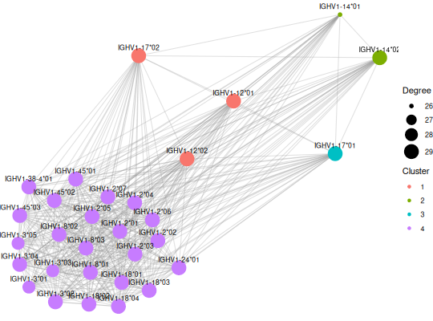

**plotCommunityNetwork** - *Plot community network*

Description
--------------------

Creates a network visualization of allele clusters from community detection.


Usage
--------------------
```
plotCommunityNetwork(
x,
layout = c("fr", "kk", "circle"),
node_color = "cluster",
node_size = "degree",
edge_alpha = 0.3,
show_labels = TRUE,
label_size = 3,
...
)
```

Arguments
-------------------

x
:   A GermlineCluster object with Leiden clustering

layout
:   Network layout: "fr" (Fruchterman-Reingold, default), "kk" (Kamada-Kawai), or "circle"

node_color
:   Variable for node color: "cluster" (default), "family", or a color value

node_size
:   Variable for node size: "degree" (default), "fixed", or a numeric value

edge_alpha
:   Alpha transparency for edges. Default is 0.3.

show_labels
:   Logical. Show node labels. Default is TRUE.

label_size
:   Size of node labels. Default is 3.

...
:   Additional arguments


Value
-------------------

A ggplot object


Details
-------------------

This function creates a network visualization showing:

+  Nodes representing alleles, colored by cluster
+  Edges weighted by sequence similarity
+  Layout optimized by specified algorithm


Examples
-------------------

```R
data(HVGERM)
asc <- inferAlleleClusters(HVGERM[1:30],
clustering_method = "leiden",
target_clusters = 5)

```

*Optimizing resolution using silhouette score...*
```R
plotCommunityNetwork(asc)

```




See also
-------------------

`[inferAlleleClusters](inferAlleleClusters.md)`, `[detect_communities_leiden](detect_communities_leiden.md)`


