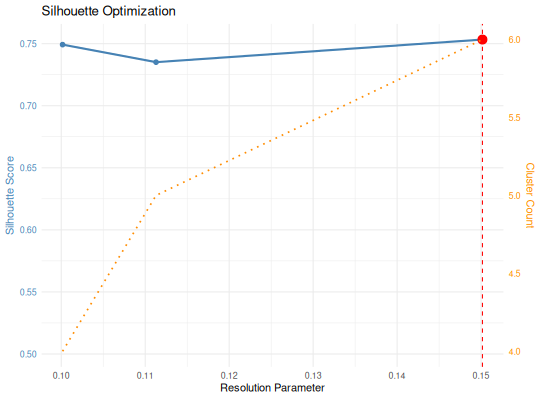

**plotSilhouetteOptimization** - *Plot silhouette optimization results*

Description
--------------------

Creates a plot showing silhouette score and cluster count across resolution values.


Usage
--------------------
```
plotSilhouetteOptimization(optimization_result, highlight_best = TRUE, ...)
```

Arguments
-------------------

optimization_result
:   Result from `[optimize_resolution](optimize_resolution.md)`

highlight_best
:   Logical. Highlight optimal resolution. Default is TRUE.

...
:   Additional arguments


Value
-------------------

A ggplot object


Examples
-------------------

```R
data(HVGERM)
d <- igDistance(HVGERM[1:30], method = "hamming")
g <- distance_to_graph(d)
opt <- optimize_resolution(g, d, target_clusters = 5)
plotSilhouetteOptimization(opt)

```




See also
-------------------

`[optimize_resolution](optimize_resolution.md)`, `[igClust](igClust.md)`


