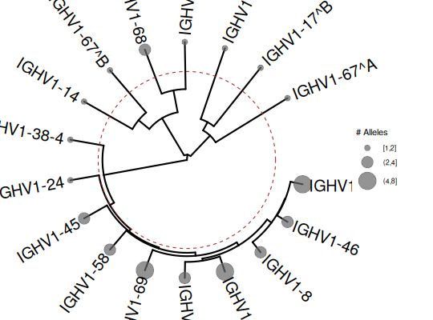

**plotTruncatedTree** - *Plot truncated tree visualization*

Description
--------------------

Creates a circular or dendrogram tree visualization collapsed to ASC subgroup level,
with optional heatmap annotations showing family assignments.


Usage
--------------------
```
plotTruncatedTree(
x,
layout = c("circular", "dendrogram"),
collapse_to = c("asc_subgroup", "iuis_subgroup", "family"),
label_style = c("asc", "iuis", "both"),
show_threshold_line = TRUE,
threshold = 0.25,
tip_size_by = "n_alleles",
tip_color_by = "present",
show_heatmap = TRUE,
label_size = 7,
...
)
```

Arguments
-------------------

x
:   A GermlineCluster object from `[inferAlleleClusters](inferAlleleClusters.md)`

layout
:   Tree layout: "circular" (default) or "dendrogram"

collapse_to
:   Level to collapse tree: "asc_subgroup" (default, based on ASC names),
"iuis_subgroup" (based on original IUIS gene names), or "family"

label_style
:   Label style for tips: "asc" (default, show ASC names like IGHVF1-G1),
"iuis" (show IUIS names with superscript markers if ASC splits IUIS group),
or "both" (show both names)

show_threshold_line
:   Logical. Show threshold line on tree. Default is TRUE.

threshold
:   Threshold height for threshold line (0-1 scale). Default is 0.25.

tip_size_by
:   Variable for tip point size: "n_alleles" (default), "fixed", or NULL

tip_color_by
:   Variable for tip point color: "present" (default), "fraction_novel", or NULL

show_heatmap
:   Logical. Show heatmap annotation for IUIS vs ASC families. Default is TRUE.

label_size
:   Size of tip labels. Default is 7.

...
:   Additional arguments passed to ggtree


Value
-------------------

A ggplot/ggtree object


Details
-------------------

This function creates a publication-quality tree visualization that:

+  Renames tree tips from original allele names to ASC names (new_allele)
+  Collapses alleles to ASC subgroup level (single representative per ASC group)
+  Shows tip point size by number of alleles in cluster
+  Adds optional heatmap track showing IUIS vs ASC family assignments
+  Draws threshold line at specified height


When using `label_style = "iuis"`, if multiple ASC groups split a single IUIS
subgroup, the labels are marked with superscript letters (e.g., IGHV1-2^A, IGHV1-2^B)
to distinguish them.

Requires the ggtree package to be installed.


Examples
-------------------

```R
data(HVGERM)
asc <- inferAlleleClusters(HVGERM[1:50])

# Basic truncated tree with ASC labels
if (requireNamespace("ggtree", quietly = TRUE)) {
plotTruncatedTree(asc, show_heatmap = FALSE)

# With IUIS labels (marked if ASC splits IUIS group)
plotTruncatedTree(asc, label_style = "iuis", show_heatmap = FALSE)
}

```




See also
-------------------

`[inferAlleleClusters](inferAlleleClusters.md)`, `[plot.GermlineCluster](plot.GermlineCluster.md)`


